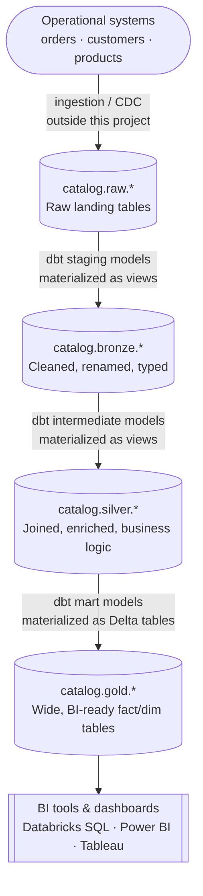
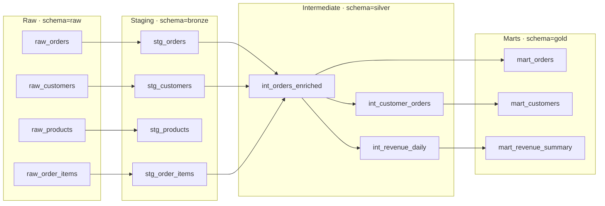
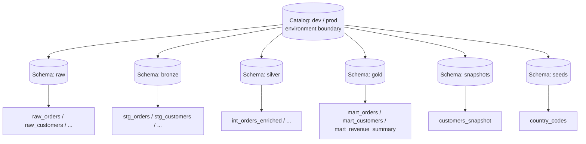
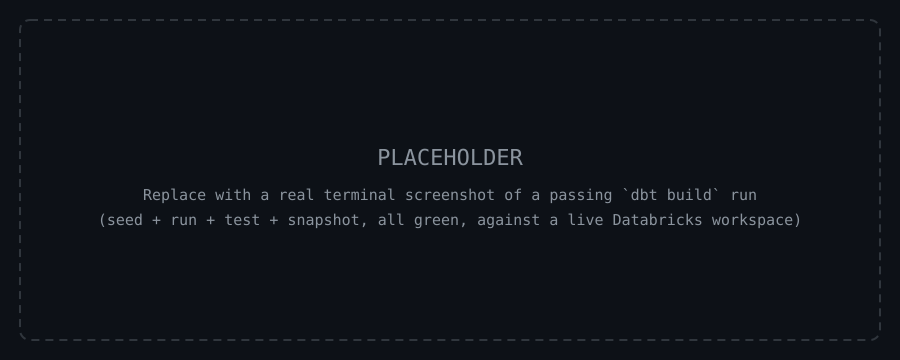
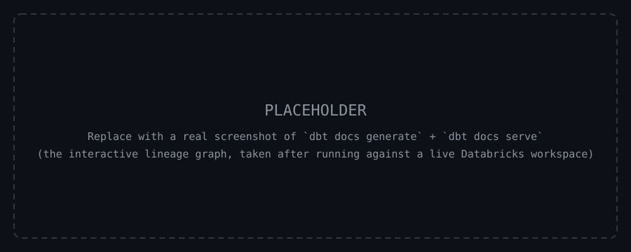

# 🚀 dbt Retail Analytics — Databricks + Unity Catalog

A production-quality **dbt** project modeling a retail/e-commerce dataset on **Databricks**, using **Unity Catalog** and the **medallion architecture** (bronze → silver → gold), mapped onto dbt's own staging → intermediate → marts layering.


---

## 📋 Table of Contents

- [Architecture Overview](#️-architecture-overview)
- [Project Structure](#-project-structure)
- [Data Flow & Lineage](#-data-flow--lineage)
- [Data Models](#-data-models)
- [Setup & Installation](#️-setup--installation)
- [Databricks Connection](#-databricks-connection)
- [Running Tests](#-running-tests)
- [Documentation](#-documentation)
- [Data Sources](#️-data-sources)
- [Mart Outputs](#-mart-outputs)
- [Contributing](#-contributing)

---

## 🏗️ Architecture Overview

Raw data lands in Unity Catalog via an external ingestion process (outside this project's scope). dbt owns everything from that point on — cleaning, joining, and shaping it into the medallion layers, each mapped to its own Unity Catalog **schema** within an environment-scoped **catalog**.



| Medallion layer | dbt layer | Unity Catalog schema | Materialization |
|---|---|---|---|
| Bronze | `staging` | `bronze` | view |
| Silver | `intermediate` | `silver` | view |
| Gold | `marts` | `gold` | table (Delta) |

---

## 📁 Project Structure

```text
dbt_databricks_retail/
├── dbt_project.yml            # Project config + materialization rules
├── packages.yml                # dbt-utils, dbt-expectations
├── profiles.yml.example        # Connection template (never commit the real one)
├── .env.example                 # Databricks env var template
├── .gitignore
├── analyses/                    # Ad-hoc SQL, not part of the DAG
├── macros/
│   ├── generate_schema_name.sql # Maps +schema config directly to bronze/silver/gold
│   └── cents_to_pounds.sql      # Pence → GBP conversion helper
├── models/
│   ├── staging/                 # Bronze — 1:1 with raw sources, light cleanup
│   │   ├── _sources.yml
│   │   ├── _staging.yml
│   │   ├── stg_orders.sql
│   │   ├── stg_customers.sql
│   │   ├── stg_products.sql
│   │   └── stg_order_items.sql
│   ├── intermediate/            # Silver — joins, business logic
│   │   ├── _intermediate.yml
│   │   ├── int_orders_enriched.sql
│   │   ├── int_customer_orders.sql
│   │   └── int_revenue_daily.sql
│   └── marts/                   # Gold — final wide tables for BI
│       ├── core/
│       │   ├── _core.yml
│       │   ├── mart_orders.sql
│       │   └── mart_customers.sql
│       └── finance/
│           ├── _finance.yml
│           └── mart_revenue_summary.sql
├── seeds/
│   └── country_codes.csv        # Static lookup: country_code → name, region
├── snapshots/
│   └── customers_snapshot.sql   # SCD Type 2 history of customers
└── tests/
    └── assert_revenue_positive.sql  # Singular test
```

---

## 🔄 Data Flow & Lineage



**Unity Catalog namespace** — every relation dbt builds resolves to a three-level `catalog.schema.table` path:



`catalog` separates environments (`dev` vs `prod`); `schema` separates medallion layers. This is enforced by [`macros/generate_schema_name.sql`](macros/generate_schema_name.sql), which overrides dbt's default schema-naming behavior so `+schema: bronze` maps directly to the `bronze` schema, rather than being prefixed with the target schema.

---

## 📊 Data Models

| Layer | Model | Materialization | Why |
|---|---|---|---|
| Staging | `stg_customers`, `stg_orders`, `stg_products`, `stg_order_items` | `view` | Thin, 1:1 pass-through of a raw source — cheap to compute, always reflects the latest raw data, rarely queried directly |
| Intermediate | `int_orders_enriched`, `int_customer_orders`, `int_revenue_daily` | `view` | Independently queryable for debugging; avoids duplicating join logic into every downstream consumer (the trade-off with `ephemeral`) |
| Marts | `mart_orders`, `mart_customers`, `mart_revenue_summary` | `table` (Delta) | BI tools query these repeatedly — pay the join/aggregation cost once at build time; only physical Delta tables support `OPTIMIZE`/`ZORDER` |
| Snapshot | `customers_snapshot` | snapshot | SCD Type 2, append-only history of the customers source |
| Seed | `country_codes` | seed | Static reference data, versioned as a CSV in this repo |

---

## ⚙️ Setup & Installation

```bash
# 1. Clone the repo
git clone https://github.com/rehman04/dbt-databricks-retail.git
cd dbt-databricks-retail

# 2. Create and activate a virtual environment
python3 -m venv venv
source venv/bin/activate

# 3. Install dbt-core + the Databricks adapter
pip install dbt-databricks

# 4. Install this project's dbt packages (dbt-utils, dbt-expectations)
dbt deps
```

---

## 🔌 Databricks Connection

```bash
# 1. Copy the templates
cp profiles.yml.example profiles.yml   # gitignored — your real connection config
cp .env.example .env                    # gitignored — your real credentials

# 2. Fill in .env with your workspace's values, then load them into your shell
set -a && source .env && set +a

# 3. Confirm the connection works
dbt debug --profiles-dir .
```

| Field | Where to find it in Databricks |
|---|---|
| `host` | SQL Warehouses → your warehouse → Connection details → **Server hostname** |
| `http_path` | Same tab → **HTTP path** |
| `token` | User menu (top right) → Settings → Developer → Access tokens → **Generate new token** |
| `catalog` | Catalog Explorer (left sidebar) — the Unity Catalog catalog name |

---

## ✅ Running Tests

```bash
dbt seed              # Load seeds/country_codes.csv
dbt run                # Build all models in DAG order
dbt snapshot           # Capture SCD Type 2 history
dbt test               # Run every schema + singular test
# or, all of the above in one DAG-ordered pass:
dbt build
```



---

## 📖 Documentation

```bash
dbt docs generate   # Build the docs site + lineage graph from the manifest
dbt docs serve       # Serve it locally (opens in your browser)
```



### dbt commands cheatsheet

| Command | What it does |
|---|---|
| `dbt debug` | Validates project + profile config, tests the warehouse connection |
| `dbt deps` | Installs packages declared in `packages.yml` |
| `dbt seed` | Loads CSVs in `seeds/` as tables |
| `dbt run` | Builds all models, in DAG order |
| `dbt run --select +mart_orders` | Builds `mart_orders` and everything it depends on |
| `dbt run --select stg_orders+` | Builds `stg_orders` and everything downstream of it |
| `dbt test` | Runs all schema tests + singular tests |
| `dbt snapshot` | Runs all snapshots (SCD Type 2 capture) |
| `dbt build` | `seed` + `run` + `snapshot` + `test`, in DAG order |
| `dbt run --select state:modified+` | Slim CI — rebuilds only models changed vs. a prior state |
| `dbt docs generate` / `dbt docs serve` | Builds and serves the documentation site |
| `dbt clean` | Removes `target/` and `dbt_packages/` |

---

## 🗄️ Data Sources

Raw tables are expected in Unity Catalog under the `raw` schema (declared in [`models/staging/_sources.yml`](models/staging/_sources.yml)), landed there by an ingestion process outside this project:

| Table | Grain |
|---|---|
| `raw_orders` | One row per order |
| `raw_customers` | One row per customer |
| `raw_products` | One row per product |
| `raw_order_items` | One row per order line item |

---

## 📈 Mart Outputs

- **`mart_orders`** — wide order-grain fact table for BI reporting
- **`mart_customers`** — customer 360 view with lifetime value and value-based segmentation
- **`mart_revenue_summary`** — finance-ready daily revenue with rolling 7/30-day windows

---

## 🤝 Contributing

Issues and PRs welcome. Please run `dbt build` locally before opening a PR — every model should build clean and every test should pass.

## License

MIT — see [LICENSE](LICENSE).
